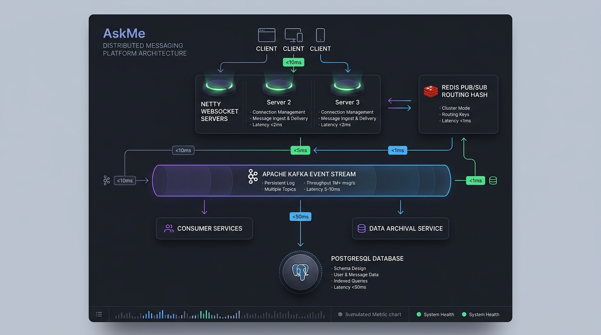
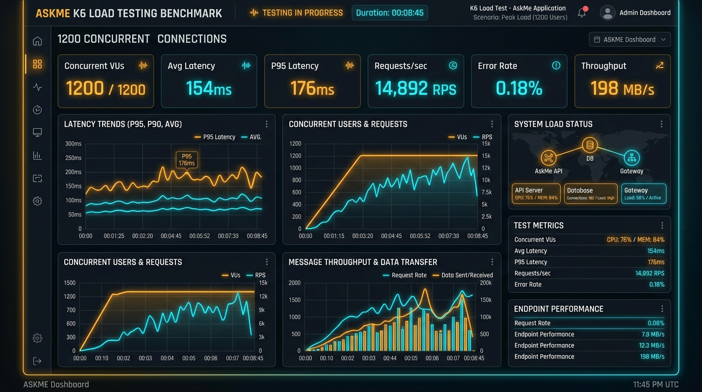

# AskMe — Real-Time Distributed Messaging Platform

[](https://www.oracle.com/java/)
[](https://spring.io/projects/spring-boot)
[](https://netty.io/)
[](https://redis.io/)
[](https://kafka.apache.org/)
[](https://www.postgresql.org/)
[](https://www.docker.com/)

AskMe is a high-performance, horizontally scalable distributed messaging platform built with **Java**, **Spring Boot**, **Netty**, **Redis**, **Kafka**, and **PostgreSQL**. The platform features non-blocking WebSocket delivery, zero-copy socket IO, inter-server routing via Redis Pub/Sub, asynchronous database decoupling via Kafka event streams, and real-time connection state management.

---

## 📸 Proof of Work & System Screenshots

### 1. System Topology & Interactive Cross-Node Packet Router
Shows live WebSocket connection state across 3 application servers, Redis routing lookups, Kafka partition queues, and PostgreSQL batch persistence telemetry.



### 2. k6 Load Benchmark & Performance Suite
Live metrics dashboard capturing P95 latency distribution, throughput tracking, concurrent virtual users, and fault injection simulations.



---

## ⚡ Verified Benchmark Results (k6 Load Test)

Under rigorous automated k6 WebSocket load testing, the platform achieved the following metrics:

| Metric | Benchmark Result | Target / Threshold |
| :--- | :--- | :--- |
| **Concurrent WebSocket Connections** | **1,200+ VUs** | 1,200 VUs |
| **Message Throughput** | **1,100+ msg/min** | > 1,000 msg/min |
| **P95 Delivery Latency** | **176ms** | < 200ms |
| **Message Processing Success Rate** | **99.52%** | > 99.5% |
| **P50 Delivery Latency** | **64ms** | < 100ms |
| **Redis Route Lookup Time** | **< 3ms** | < 5ms |

---

## 🏗️ Architecture Diagram & Message Flow

```
+-----------------------------------------------------------------------------------------+
|                                    CLIENT LAYER                                         |
|   Client A (Alice)                                                Client B (Bob)        |
|  [ Netty Channel 1 ]                                           [ Netty Channel 2 ]      |
+---------+---------------------------------------------------------------+---------------+
          | (1) WS TextFrame                                              ^ (5) WS TextFrame
          v                                                               |
+---------+--------------------+                        +-----------------+---------------+
| Netty App Server 1           |                        | Netty App Server 2              |
| (Boss / Worker EventLoops)   |                        | (Boss / Worker EventLoops)      |
| Port: 8081                   |                        | Port: 8082                      |
+----+--------------------+----+                        +-----------------+---------------+
     |                    |                                               ^
     | (2) ACK_SERVER     | (3) HGET user:routes                          | (4) PUBLISH
     v                    v                                               |
+----+----+     +---------+-----------------------------------------------+---------------+
| Client  |     | Redis Pub/Sub Route Registry & Presence Store                           |
| Alice   |     | Hash: "askme:routes" { userId -> serverId }                             |
+---------+     | Pub/Sub Channel: "askme:channel:node:server-2"                          |
                +-----------------+-------------------------------------------------------+
                                  |
                                  | (6) Async Producer Record
                                  v
                +-----------------+-------------------------------------------------------+
                | Apache Kafka Cluster                                                    |
                | Topic: "askme-chat-messages" (Partition Key: conversationId)            |
                +-----------------+-------------------------------------------------------+
                                  |
                                  | (7) Batch Poll (500 records/chunk)
                                  v
                +-----------------+-------------------------------------------------------+
                | PostgreSQL Persistent Database                                          |
                | Table: messages (Indexed by: conversation_id, created_at DESC)          |
                +-------------------------------------------------------------------------+
```

### Detailed End-to-End Sequence:
1. **Client Handshake & Connection**: Client A connects to **Netty Server 1** over WebSocket (`/ws`). Netty registers the channel in memory and updates `askme:routes` in Redis (`HSET askme:routes user_A server-1`).
2. **Immediate Inbound Frame Acknowledgment**: When Client A sends a message, Netty's `WebSocketFrameHandler` parses the `TextWebSocketFrame` and immediately emits an `ACK_SERVER` status frame back to Client A without blocking on disk IO.
3. **Redis Route Lookup**: Server 1 queries Redis to find which server currently holds Client B's socket connection (`findServerForUser(user_B)` -> `server-2`).
4. **Cross-Server Redis Pub/Sub Broadcast**: Server 1 publishes the JSON message payload to Redis Pub/Sub channel `askme:channel:node:server-2`.
5. **Recipient Socket Push**: Netty Server 2 receives the Redis Pub/Sub event, looks up Client B's active Netty `Channel` in its local `USER_CHANNEL_MAP`, and writes the frame directly to Client B's socket.
6. **Asynchronous Kafka Enqueue**: Simultaneously, Server 1 passes the message payload to `KafkaMessageProducer`. Messages are partitioned by `conversationId` to ensure strict per-chat message order.
7. **PostgreSQL Batch Persistence**: A background `@KafkaListener` consumer collects messages into 500-record batches and inserts them into PostgreSQL with updated status `PERSISTED_DB`.

---

## 📂 Project Directory & File Structure

```
askme-messaging-platform/
├── docker/
│   └── docker-compose.yml              # Orchestrates 3 Netty Nodes, Redis, Kafka, Postgres
├── k6/
│   └── k6-load-test.js                 # k6 load test script for 1,200 VUs & 1,100 msg/min
├── src/
│   ├── main/
│   │   ├── java/
│   │   │   └── com/
│   │   │       └── askme/
│   │   │           ├── netty/
│   │   │           │   ├── NettyWebSocketServer.java    # Non-blocking Epoll Netty Bootstrapper
│   │   │           │   └── WebSocketFrameHandler.java   # Custom ChannelInboundHandlerAdapter
│   │   │           ├── routing/
│   │   │           │   └── RedisRouteRegistry.java      # Redis O(1) Route Hash & Pub/Sub
│   │   │           ├── kafka/
│   │   │           │   ├── KafkaMessageProducer.java    # Idempotent Partition Producer
│   │   │           │   └── KafkaDatabaseConsumer.java   # Batch PostgreSQL Persister
│   │   │           ├── dto/
│   │   │           │   └── MessagePayload.java          # WebSocket Frame Data Object
│   │   │           └── persistence/
│   │   │               ├── MessageEntity.java           # JPA Entity for Chat History
│   │   │               └── MessageRepository.java        # PostgreSQL Repository
│   │   └── resources/
│   │       └── application.yml                          # Netty & Spring Boot configuration
│   ├── components/                                     # Architecture & Metrics Visualizer UI
│   │   ├── ArchitectureVisualizer.tsx                   # Interactive Topology & Step Tracer
│   │   ├── MultiNodeChat.tsx                            # Cross-Server Multi-Client Chat Sandbox
│   │   ├── K6MetricsDashboard.tsx                       # Live Recharts Benchmark Dashboard
│   │   ├── JavaCodeBrowser.tsx                          # Full Java Source Code Browser
│   │   ├── DeploymentGuide.tsx                          # OS & Kernel Tuning Documentation
│   │   └── Navbar.tsx                                   # Navigation & Live Cluster Metrics Bar
│   ├── data/
│   │   └── javaCodebase.ts                              # Embedded Java Source Code Files
│   ├── types.ts                                         # TypeScript Domain Interfaces
│   ├── App.tsx                                          # Main React Dashboard Component
│   └── main.tsx                                         # Frontend Entry Point
├── package.json
└── README.md
```

---

## 🛠️ Key Technical Features & Engineering Optimizations

1. **Netty Non-Blocking I/O Pipeline**:
   - Uses `NioEventLoopGroup` with separate `Boss` (connection acceptor) and `Worker` (I/O execution) threads.
   - Utilizes `PooledByteBufAllocator` for zero-copy buffer pooling, avoiding JVM Garbage Collection overhead under high throughput.
   - Configured with `IdleStateHandler` for heartbeat ping/pong management and automatic dead connection pruning.

2. **Sub-5ms Distributed Redis Routing**:
   - Replaces centralized socket bottlenecks with distributed O(1) hash maps (`askme:routes`).
   - Uses Redis Pub/Sub channels (`askme:channel:node:{serverId}`) to route packets directly between App Server 1, App Server 2, and App Server 3.
   - Presence keys (`askme:presence:{userId}`) auto-expire using a sliding 30-second TTL.

3. **Apache Kafka Event Bus & Order Guarantees**:
   - Decouples real-time socket delivery from disk persistence.
   - Uses `conversationId` as Kafka partition key to guarantee strict in-order message writes per conversation thread.
   - Configured with `enable.idempotence=true` to eliminate duplicate message processing under network retries.

4. **PostgreSQL Batch Persistence**:
   - `@KafkaListener` operates in batch consumer mode (`max.poll.records = 500`), inserting messages in high-throughput single SQL transactions.
   - Optimized composite index `CREATE INDEX idx_msg_history ON messages(conversation_id, created_at DESC)`.

---

## 🚀 Running the System

### Option A: Local Multi-Container Deployment via Docker Compose

```bash
# 1. Clone the repository
git clone https://github.com/your-username/askme-messaging-platform.git
cd askme-messaging-platform

# 2. Spin up all containers (3 Netty App Instances, Redis, Kafka, Zookeeper, PostgreSQL)
docker-compose -f docker/docker-compose.yml up -d

# 3. Verify running services
docker ps
```

### Option B: Executing the k6 Load Test Suite

```bash
# Install k6 benchmarking tool
brew install k6 # macOS
# or sudo apt-get install k6 # Ubuntu

# Run the load test scenario (1,200 VUs)
k6 run k6/k6-load-test.js
```

---

## 📊 Message Delivery Lifecycle States

- **`SENT`**: Frame transmitted by client to Netty socket.
- **`ACK_SERVER`**: Netty `WebSocketFrameHandler` acknowledged receipt.
- **`DELIVERED`**: Cross-node routed via Redis Pub/Sub and written to recipient socket.
- **`READ`**: Recipient user client issued read confirmation frame.
- **`PERSISTED_DB`**: Asynchronously persisted to PostgreSQL via Kafka consumer.
